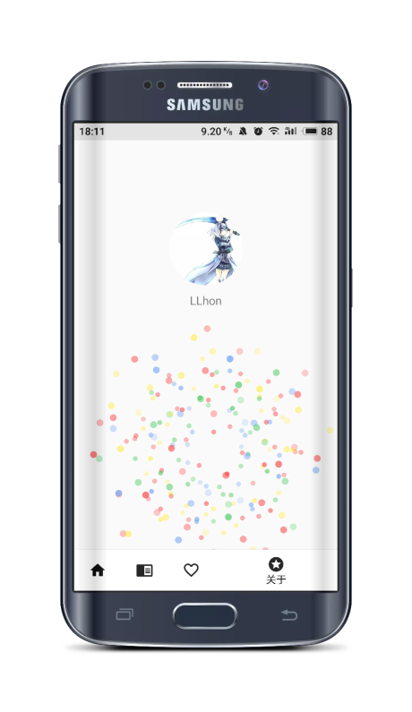

## 介绍

- Gank.io 使用Kotlin语言实现的干货集中营客户端

## 项目模式
 - MVP
 - Kotlin
 - Retrofit
 - RxJava
 - RxAndroid
 - Material Design
 - Glide
 - ByeBurger
 - MultiStateView
 - base-rvadapter
 - lottie
 - circleimageview

## 下载地址

 [Github](https://github.com/LLhon/KotlinGank-master/gank.apk)
 
  
  
 
## 效果图

 
 
     
 

## 感谢
 - [干货集中营](http://gank.io/)提供的数据   
 
 
 

## 关于
 - 亲, 喜欢就start一下吧~
 
## License
 
           KotlinGank  Copyright (C) 2018  LLhon hon0608@163.com
           This program comes with ABSOLUTELY NO WARRANTY; for details type `show w'.
           This is free software, and you are welcome to redistribute it
           under certain conditions; type `show c' for details.
 
       The hypothetical commands `show w' and `show c' should show the appropriate
       parts of the General Public License.  Of course, your program's commands
       might be different; for a GUI interface, you would use an "about box".
 
         You should also get your employer (if you work as a programmer) or school,
       if any, to sign a "copyright disclaimer" for the program, if necessary.
       For more information on this, and how to apply and follow the GNU GPL, see
       <http://www.gnu.org/licenses/>.
 
         The GNU General Public License does not permit incorporating your program
       into proprietary programs.  If your program is a subroutine library, you
       may consider it more useful to permit linking proprietary applications with
       the library.  If this is what you want to do, use the GNU Lesser General
       Public License instead of this License.  But first, please read
       <http://www.gnu.org/philosophy/why-not-lgpl.html>.
 
 
 

